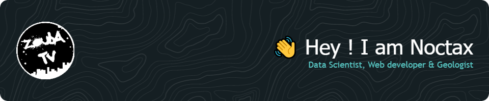

- 👀 I’m interested in Geology, Geophysics, Geotechnical Engineering, Data Science and Web development.

- 💻 Passionate in Data Science, Web application development and Open Source contributor

- 🌱 I’m currently learning Machine learning with Python, Frontend dev: HTML/CSS/Javascript "React" and Backend dev with Python "streamlib & Flask".

- 💞️ I’m looking to collaborate on Datascience Web application proejcts.

- 📊 All of my projects are available [here](https://github.com/Noctax?tab=repositories)

- 💬 Don't hesitate to contact me

<!---
Noctax/Noctax is a ✨ special ✨ repository because its `README.md` (this file) appears on your GitHub profile.
You can click the Preview link to take a look at your changes.
--->
